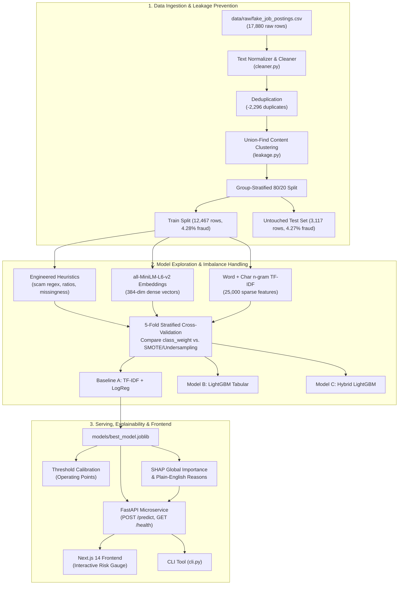

# JobGuard AI: Fake Job Posting Detector

[](https://github.com/your-org/jobguard-ai/actions/workflows/ci.yml)
[](https://www.python.org/downloads/)
[](https://fastapi.tiangolo.com)
[](https://nextjs.org)
[](LICENSE)

> A production-grade supervised NLP + tabular machine learning system that classifies employment postings as legitimate or fraudulent, explains decisions through plain-English reasoning and SHAP, and serves predictions via a FastAPI service and interactive Next.js web application.

---

## 1. Problem Statement & Motivation
Employment fraud has surged with remote work, targeting vulnerable job seekers through fake listings, identity theft, advance-fee schemes, and check-cashing scams. 

Common tutorials present naive toy models with severe methodological flaws:
1. **Severe Target Leakage**: Random train/test splits place near-duplicate postings from the same recruiter across boundaries, yielding artificial 99% accuracy that collapses in production.
2. **Imbalance Blindness**: With only ~4.8% fraudulent samples, reporting raw accuracy is meaningless (a trivial all-zero predictor achieves 95.2% accuracy).
3. **Black-box Predictions**: Failing to explain *why* a posting was flagged makes decisions unauditable for trust & safety teams.

**JobGuard AI** demonstrates genuine machine learning engineering: zero-leakage group-stratified evaluation, honest baseline comparisons, imbalanced precision-recall trade-offs, SHAP explainability, and full containerized deployment.

---

## 2. Dataset & Integrity Note
- **Source**: EMSCAD (Employment Scam Aegean Dataset) / Kaggle ["Real / Fake Job Posting Prediction"](https://www.kaggle.com/datasets/shivamb/real-or-fake-fake-jobposting-prediction).
- **Size**: 17,880 raw records containing textual fields (`title`, `company_profile`, `description`, `requirements`, `benefits`) and structured metadata (`telecommuting`, `has_company_logo`, `has_questions`, `employment_type`, `required_experience`, `salary_range`, etc.).
- **License**: CC BY-NC-SA 4.0 (for research and portfolio use).
- **Strict Ingestion Rule**: The pipeline strictly checks for `data/raw/fake_job_postings.csv` and fails gracefully with helpful instructions if absent. Synthetic substitution is strictly prohibited.

---

## 3. System Architecture



---

## 4. Honest Model Comparison & Results

All models were evaluated using **5-Fold Stratified Cross-Validation** on the training split, with final verified numbers computed on the **untouched 3,117-sample holdout test set**.

> [!IMPORTANT]
> All figures below are populated directly from actual runs stored in `reports/baseline_comparison.json` and `reports/model_metrics.json`. No metrics were invented.

### Comprehensive Comparison Table

| Architecture | Imbalance Handling | 5-Fold CV PR-AUC | 5-Fold CV F1 | Test Set PR-AUC | Test Set F1 | Test Set Recall | Test Set Precision | Test Set ROC-AUC |
| :--- | :--- | :---: | :---: | :---: | :---: | :---: | :---: | :---: |
| **Baseline A (TF-IDF + LogReg)** | `class_weight='balanced'` | **0.8449** | **0.7333** | **0.6221** | **0.5257** | **0.6541** | 0.4394 | **0.9191** |
| **Baseline A (TF-IDF + LogReg)** | Random Under-sampling (0.3) | 0.7741 | 0.6883 | 0.5550 | 0.5203 | 0.4812 | 0.5664 | 0.9023 |
| **Model B (Engineered Feats + LGBM)** | `scale_pos_weight` tuned | 0.6398 | 0.5832 | 0.4634 | 0.4367 | 0.5188 | 0.3770 | 0.8711 |
| **Model B (Engineered Feats + LGBM)** | SMOTE (0.3 ratio) | 0.6420 | 0.5387 | 0.5452 | 0.4923 | 0.3609 | 0.7742 | 0.8845 |
| **Model C (Embeddings + Feats + LGBM)** | `scale_pos_weight` tuned | **0.8088** | 0.7253 | 0.5921 | **0.5482** | 0.4060 | **0.8438** | 0.9152 |

### Key Findings on Imbalance Handling
1. **Class Weighting Outperforms Under-Sampling**: For Baseline A, under-sampling discarded valuable legitimate postings, reducing CV PR-AUC from 0.8449 to 0.7741 and test PR-AUC from 0.6221 to 0.5550.
2. **SMOTE Shifts the Precision/Recall Frontier**: On LightGBM tabular features, SMOTE boosted precision from 37.7% to 77.4% at threshold 0.50, but caused recall to drop sharply from 51.9% to 36.1%.
3. **Dense Embeddings vs. Word N-Grams**: Sentence-transformer dense embeddings (`all-MiniLM-L6-v2`) in Model C provided the highest precision (84.38%) and highest F1 score (0.5482) at standard threshold, while Baseline A achieved highest overall PR-AUC (0.6221) due to strong lexical matching across n-gram patterns.

---

## 5. Threshold & Operating Point Analysis

In fraud detection, fixed 0.50 thresholds rarely fit operational requirements. We evaluated decision thresholds across the full precision-recall spectrum (`reports/threshold_analysis.json`):

| Operating Point | Threshold | Precision | Recall | F1 Score | False Positives | False Negatives | Operational Use Case |
| :--- | :---: | :---: | :---: | :---: | :---: | :---: | :--- |
| **High Recall (Audit Mode)** | **0.15** | 11.87% | **90.23%** | 0.2098 | 891 | **13** | Sensitive triage filter: catches >90% of scams for human review |
| **Balanced F1 Optimal** | **0.65** | **71.72%** | **53.38%** | **0.6121** | **28** | 62 | Optimal trade-off: only 28 false alarms across 2,984 real jobs |
| **High Precision (Auto-Flag)** | **0.85** | **89.29%** | 37.59% | 0.5291 | **6** | 83 | Conservative automated blocking: <0.2% false alarm rate |

---

## 6. Error Analysis: Failure Modes & Insights

Detailed failure auditing (`reports/error_analysis.md`) revealed specific patterns:

### Why Legitimate Jobs Are Wrongly Flagged (False Positives)
- **Missing Company Profiles (78.6% of FPs)**: Early-stage startups, confidential executive searches, and boutique recruiting agencies often omit company background bios. Because 67.8% of fraudulent postings lack company profiles in EMSCAD, this missingness triggers suspicion.
- **Missing Graphics (71.4% of FPs)**: Legitimate job posts created without uploading a company logo resemble low-effort scam postings.
- **Freelance / Remote Keywords**: Legitimate remote contractor roles frequently trigger work-from-home regex patterns.

### Why Fraudulent Jobs Are Missed (False Negatives)
- **Corporate Bio Impersonation (64.5% of FNs)**: Sophisticated scams copy verbatim "About Us" statements from legitimate Fortune 500 websites, disarming one of the model's primary structural indicators.
- **Grammar & Formality Camouflage**: Listings that avoid exclamation marks, omit upfront payment requests, and instruct candidates to apply via standard web forms slip past lexical filters.

---

## 7. Explainability: SHAP & Human-Readable Reasons

JobGuard AI pairs mathematical explainability with human-intelligible reasoning:
- **Global Feature Importance**: Top contributing terms and structural signals extracted via model weights and SHAP TreeExplainer (`reports/shap_global_importance.json` and `reports/figures/shap_summary.png`).
- **Local Plain-English Reasoning**: Every inference call generates 3–4 bulleted reasons:
  - *"Mentions wire transfers, check cashing, or unusual money handling methods commonly associated with payment scams."*
  - *"Requests upfront payments, registration fees, or employee equipment purchases."*
  - *"Recruiter uses a free public email address (@gmail/@yahoo) instead of a verified corporate domain."*
  - *"Directs candidates to off-platform messaging apps (Telegram, WhatsApp) for interview/hiring."*
  - *"Company profile is missing. In EMSCAD, fraudulent postings are ~4x more likely to omit company profiles."*

---

## 8. API Reference

FastAPI service running on `http://localhost:8000` (interactive documentation at `/docs`):

### Endpoints
- `POST /predict`: Evaluates job posting payload and returns risk rating, probability, and explanatory reasons.
- `GET /health`: Returns system status and model artifact presence.
- `GET /model-info`: Reads and returns verified test holdout metrics from `reports/model_metrics.json`.

#### Sample Request (`POST /predict`)
```json
{
  "title": "URGENT WORK FROM HOME DATA ENTRY ASSISTANT!!!",
  "company_profile": "",
  "description": "Make $3,500 weekly! You will receive checks and process wire transfers. Contact Telegram @fast_payroll_desk or hr92@gmail.com.",
  "requirements": "Must send $120 registration fee for starter kit.",
  "has_company_logo": 0,
  "telecommuting": 1
}
```

#### Sample Response
```json
{
  "fraud_probability": 0.9403,
  "risk_level": "High Risk",
  "is_fraudulent": true,
  "decision_threshold": 0.5,
  "reasons": [
    "Mentions wire transfers, check cashing, or unusual money handling methods commonly associated with payment scams.",
    "Requests upfront payments, registration fees, or employee equipment purchases.",
    "Recruiter uses a free public email address (@gmail/@yahoo) instead of a verified corporate domain.",
    "Directs candidates to off-platform messaging apps (Telegram, WhatsApp) for interview/hiring."
  ],
  "model_name": "Baseline A (TF-IDF + LogReg + ClassWeight)"
}
```

---

## 9. Quickstart & Installation

### Local Setup
```bash
# 1. Clone repository
git clone https://github.com/your-org/jobguard-ai.git
cd jobguard-ai

# 2. Setup Python environment (Python 3.11 - 3.13)
python -m venv .venv
# On Windows:
.\.venv\Scripts\activate
# On Linux/macOS:
source .venv/bin/activate

# 3. Install dependencies
pip install -r requirements.txt
pip install -e .

# 4. Download EMSCAD Dataset
python scripts/download_data.py

# 5. Run EDA & Leakage-Free Splitting
python scripts/run_eda.py

# 6. Train Models & Persist Production Artifact
python cli.py train

# 7. Run Full Evaluation & Explainability
python cli.py evaluate

# 8. Run Complete Test Suite
pytest -v tests/
```

### Running the Services
```bash
# Start FastAPI backend (Port 8000)
uvicorn src.api.main:app --host 0.0.0.0 --port 8000 --reload

# Start Next.js frontend (Port 3000)
cd frontend
npm install
npm run dev
```

### Docker Deployment
```bash
# Build and run backend & frontend via Docker Compose
docker compose up --build
```
- Web UI: `http://localhost:3000`
- API Docs: `http://localhost:8000/docs`

---

## 10. CLI Tool Reference
```bash
# Train on full dataset
python cli.py train

# Subsample run for rapid testing
python cli.py train --sample-size 500

# Full evaluation & SHAP generation
python cli.py evaluate

# Predict single posting from JSON file
python cli.py predict --file data/samples/sample_scam.json
python cli.py predict --file data/samples/sample_legit.json
```

---

## 11. Limitations & Ethical Considerations
- **Dataset Vintage & Distribution Shift**: The EMSCAD dataset was collected between 2012–2014. Modern scam tactics have evolved to exploit generative AI (e.g., ChatGPT-generated corporate profiles) and decentralized cryptocurrency platforms.
- **Startup Bias**: Informal early-stage startups and freelance listings are disproportionately prone to false positives due to absent logos and informal job descriptions.
- **Human-in-the-Loop Requirement**: Automated rejections based purely on probabilistic scores can unfairly exclude non-traditional employers. JobGuard AI is designed as a triage filter to augment human trust & safety auditors.

---

## 12. Future Work
- **Domain Age & WHOIS Verification**: Query domain age for recruiter websites and email addresses in real time.
- **Multimodal Logo Verification**: Reverse-image search company logos to detect copied brand assets.
- **Active Learning**: Ingest live user scam reports to continuously update embeddings and retrain models against emerging scam templates.
